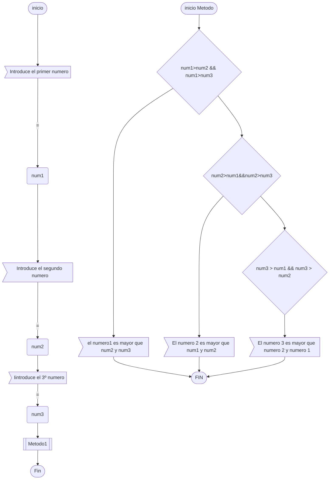

# examenDAM
Para utilizarlo en el examen

#Primera Modificación README.md

	-El primer paso es clonar el repositorio:
	git clone https://github.com/damiancastelao/examenDAM.git

-El segundo paso es entrar en la carpeta del Repositorio Clonado (cd
examenDAM )

	ahí veremos el archivo Readme.md
	con nano README.md estoy haciendo la primera modificación, desde 
la consola, presiono Control+X para salir, indico que quiero guardar con
"Y" y enter, archivo modificado

	-con el comando cat README.md muestro el contenido y compruebo que 
efectivamente la modificacion se ha guardado

# CREO EL REPOSITORIO EN GITHUB

una vez creado el repositorio me dispongo a subirlo:

	-para ello tengo que añadir el archivo con git add . (el punto 
	añade todo, incluido los archivos ocultos, también se podría hacer con git 
	add README.md

Como no queremos archivos basura, voy a subir solo el README.md

-procedo a hacer el primer commit

-y antes de hacer el git push tengo que cambiar la url a mi repositorio,
ya que recordemos que lo he clonado desde el Repo de Damian

	-git remote set-url origin (url mi repo) 
con esto cambio la direccon del repositorio al que lo voy a subir

debo hacer un:

	-git branch main

para cambiar de la rma master a la rama main, para hacer las cosas bien :)

y finalmente lo subo con:

	-git push origin main

normalmente pedira usuario y token, pero en el caso de Mac, no me
hace falta ya que me guarda el token  

#	Segungo Commit:

A continuación procedo a hacer el segundo commit;
añado mi ejercicio1 del boletin7 donde se comparan con un if 3 números,
pero esque además este comit lo hago cambiando el nombre del autor,
para ello emplearemos los siguientes comandos:

    -git config user.name "Damián el mejor profe del mundo"
    -git add README.md
    -git add Boletin7_1/src
    -git commit -m "Actualizo el Readme.md y subo my proyecto src"
    -git push origin master

nota:
* Estoy usando java 17 

se suben los cambios a la rama master

# Tercer commit
*CREO EL ARCHIVO MERMAID

